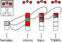

Concepts
========

Overview
--------
PiNN abstract atomic neural networks (ANNs) with three levels: layers, networks
and models. This abstraction helps to reuse common parts of various ANNs and
construct customized models with existing components.

Layers
------

Nodes
^^^^^^
Nodes are the most basic elements of layers. A node refers to some property that
is tied to some object: be it molecule, atom, pair or triplet.

In PiNN, all nodes are represented sparsely. Higher order nodes are specified
by the indices of their components. For example, pairs are defined by two atoms,
triplets are defined by two pairs (with a shared atoms), etc.
Additionally, atoms are labeled by their ids in the batch during training.
One way to think about it is that there's a 0th order object (the sample)
connected to each atom.

The idea of PiNN is that the triplet interaction function (say the bond angle)
can be seen as a function of a pairwise distance, whose shape depends on the
properties of of two pairs (in this case, the bond length).
This way, n-body interactions are just pairwise interaction of (n-1)-body
properties.

In this representation pairwise interactions are computed sparsely without
calculating a NxN matrix.
Pooling of higher order nodes to lower order ones is implemented
with tensorflow's `segment_*` functions.

.. _layer_types:

Common types of layers
^^^^^^^^^^^^^^^^^^^^^^
Layers are functions connecting different nodes. Furthermore, layers can be
classified to three types: pairwise interaction (PI, mapping from lower order
nodes to higher ones), interaction pooing (IP, as the opposite to PI), and
fully connected (FC) layers.

It can be shown that PI step is the characterizing component of ANNs. For
example, the Behler-Parrinello symmetry functions can be seen a fixed PI layer
(which subsequently get pooled into atoms), and graph convolution algorithms
typically features trainable PI layers. 

The IP and FC layers are less interesting. IP layers are typically summation
over higher order nodes, and FC layers are classical feed-forward neural
networks.

As most available ANNs can be represented with those three layers, and IP/FC
layers are pretty much the same. The forms of PI (the engineering of SFs, the
form of interaction functions) strongly affect the performance of ANNs.

In PiNN, layers are defined as pure functions and are expected to behave like
any tf functions. They do not contain information about their connections so
that they can be freely rewired to construct new (and hybrid) models.

Special types of layers
^^^^^^^^^^^^^^^^^^^^^^^
Filters are special types of layers: they do not contain trainable variables.
This makes it possible to evaluate the output of filters prior to training. Thus,
we can preprocess the dataset with filters during the training process and speed
up the training.

For example, the following layers are considered filters:

- neighbor list construction
- symmetry function and interaction basis calculation
- atomic dressing

Currently, filters are allowed to be non-pure functions: they alter the original
input feature tensors instead of returning a new dict of features.

Networks
--------
Network abstracts the connection of layers, which is the core of ANN models.
Several neual networks from the literature are implemented in PiNN.
The networks can generally be splitted to two classes,
fingerprints methods and graph convolution methods.
(The details are expalined separately for each network)

Fingerprint methods requires a description of the atomic environment,
so that the prediction of potential energy can be treated as a classical
regression problem.
The challenge here is to find a "good" descriptor for the local environment.

- :doc:`networks/bpnn`

The general idea behind graph convolution methods is that just like
"atomic energy", other features about the atom can be predicted.
And more complex features can be constructed from those simple ones.
Therefore, ANN can be constructed by concatenating convolution
layers which "learns" complex features from simple ones.
Unlike the fingerprint methods, the description of atomic environment
must be learnt from training process.

- :doc:`networks/pinn`
- :doc:`networks/schnet`

Models
------
The same network can be used for different purposes,
to predict energies, toxicities, dipoles, etc.
The model abstraction defines the loss function,
and thus the objective of the network.

Models are essentially model functions to interface with tensorflow's
`estimator` api. Various training related parameters are also defined in the
model function.

Currently, only the potential model is implemented,
which also provides interface to the ASE calcualtor.

