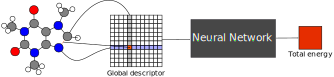
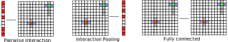

Introduction
============

PiNN named after our own :doc:`network structure <networks/pinn>` is a python library built on top of Tensorflow for building
atomic neural networks (ANN).
The primary usage of PiNN is to build and train ANN interatomic potentials,
but PiNN is also capable of predicting physical and chemical properties of molecules and materials.

ANN is a machine learning approach to make property predictions of
molecules and materials from atomic structures. Two basic requirements
of ANN is permutation invariance and input-size scalability. 

Early attempts in this direction often require the whole atomic structure
(e.g. Coulomb matrix, internal coordinates as input).
Although these approaches were found to be useful for describing small
molecules, it is limited for a general purpose, as the
input-size must be fixed.

Later approaches switch to more "local" features as inputs
(e.g. atom densities, symmetry functions).
Those networks achieved nice performance and were proven
useful for performing large-scale simulations in condensed phases.

.. image:: images/local_net.svg

Recently, different ANN implementations emerge
with varying structures and applications.
Nevertheless, we want to emphasize that despite the difference in appearance
they share quite similar components at the conceptual level. 
(:ref:`here <layer_types>` is a more detailed discussion):

- interaction between pairs (pi layers)
- obtaining atomic property from interactions (ip layers)
- feed-forward neural networks to fit complex functions (fc layers)
- and needless to say, those models requires similar input/output.

  
PiNN seeks to provide a framework and optimized components to
build and train those atomic neural networks.
The goal is to be flexible, fast and reproducible.

Flexibility
^^^^^^^^^^^

PiNN is built with modularized components and we try to make it as easy
as possible to be cutomized. So there's no need to rewrite everything if you just want to change
some of the layers, or use existing network for predicting new properties.

Speed
^^^^^

PiNN fully adheres to Tensorflow's high-level Estimator and Dataset API.
It is straightforward to train and predict on different computing platforms
(CPU, multi-GPU, google cloud, etc) without worrying about optimization.

Example
^^^^^^^

The quickest way to start with PiNN is to follow our tutorial :doc:`notebooks`.
The notebooks shall guide you from training a simple ANN potential with
to customize PiNN for your own systems.
