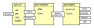

Introduction
============

PiNN (standing for Pairwise-interaction Neural Network) is a python
library built on top of Tensorflow for building atomic neural networks
(ANN).  The primary usage of PiNN is to build and train ANN
interatomic potentials, but PiNN is also capable of predicting
physical and chemical properties of molecules and materials.

Flexibility
^^^^^^^^^^^

   Fig. Illustration of PiNN's modules.

PiNN is built with modularized components and we try to make it as
easy as possible to be cutomized. You do not have to rewrite
everything if you just want to design a new network sturcture, or
applying existing network to new datasets or new properties.

Scalability
^^^^^^^^^^^

PiNN fully adheres to Tensorflow's high-level Estimator and Dataset
API.  It is straightforward to train and predict on different
computing platforms (CPU, multiple-GPU, cloud, etc) without explicit
programing.

Example
^^^^^^^

The quickest way to start with PiNN is to follow our tutorial
:doc:`notebooks`.  The notebooks shall guide you from training a
simple ANN potential with to customize PiNN for your own systems.
