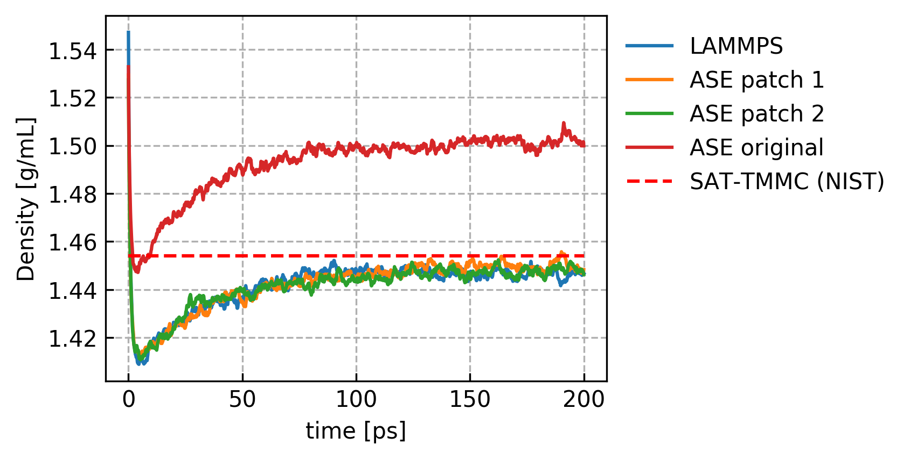

===================
Miscellaneous Notes
===================

Known issue with ASE barostats
==============================

As in ASE version 3.18, the ASE implementation of Berendsen barostat
misses the ideal gas contribution (see this `issue`_). This causes
systematic errors when using PiNN (or any other potential) with ASE
for NPT simulations. The barostat can be patched as follows:

.. code-block:: python

    from ase.md.nptberendsen import NPTBerendsen
    from ase import units
    
    def scale_positions_and_cell_with_p_kin(self):
        """ Do the Berendsen pressure coupling,
        scale the atom position and the simulation cell."""
        taupscl = self.dt / self.taup
        stress = self.atoms.get_stress(voigt=False)
        old_pressure = -stress.trace()/3 * 1e-5 / units.Pascal
        p_kin = ((len(self.atoms)/self.atoms.get_volume()*1e30)*
                 self.atoms.get_temperature()*1.38e-23*1e-5)
        old_pressure += p_kin
        scl_pressure = (1.0 - taupscl * self.compressibility / 3.0 *
                        (self.pressure - old_pressure))
    		    
        # Alternatively, the scaling factor can be calculated using
        # the below equivalent fomular, which is used in LAMMPS.
	# Both are benchmarked for comparison, the above formular is 
	# noted as patch 1 and the version below as patch 2.
        # 
        # scl_pressure = (1.0 - taupscl * self.compressibility *
        #                (self.pressure - old_pressure)) ** (1./3.)
        
        cell = self.atoms.get_cell()
        cell = scl_pressure * cell
        self.atoms.set_cell(cell, scale_atoms=True)
	
    NPTBerendsen.scale_positions_and_cell = scale_positions_and_cell_with_p_kin

The patch is benchmarked against LAMMPS at a known density of
Lennard-Jones fluids. As shown below, the patched barostat agrees well
with the LAMMPS implementation, while the original ASE barostat
overestimates the equilibrium density. Similar issues may exist in
other ASE barostats.

   Fig. Equilibrium densities of liquid argon at 78 K and 0.2933 bar
   using different implementations of the Berendsen barostat. Dashed
   line is from the NIST website.

Detailed parameters for the benchmark
-------------------------------------

The Lennard-Jones parameters proposed by Rahman :cite:`rahman1964` for
Argon is used. The simulations were carried out at 78 K and 0.2933
bar. For each barostat, a cubic simulation box was build as a 10x10x10
simple cubic lattice of argon atoms, with a box size of 35 Å. Cutoff
was set to 17 Å and no tail correction was applied. Random velocity
was assigned to each atom to achieve an initial temperature of
78 K. Each system was equilibrated using a Berendsen thermostat for
100 ps with fixed simulation box. The Berendsen barostat was then
turned on to carry out NPT simulation for 200 ps. The timestep was
chosen to be 10 fs, the thermostat and barostat time constants were
chosen to be 10 ps and 100 ps respectively, while the compressibility
was chosen to be 0.01 bar :sup:`-1`. For the sake of cross-check, the
corresponding density given at the `NIST standard reference simulation
website`_ is also shown, which is 1.454 g/mL after conversion from
reduced unit.

.. _issue: https://gitlab.com/ase/ase/issues/356
.. _NIST standard reference simulation website: https://www.nist.gov/mml/csd/chemical-informatics-research-group/sat-tmmc-liquid-vapor-coexistence-properties-cut
