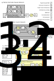

Networks
========

In PiNN, a "network" is a function with learnable parameters, which
yields atomic predictions from a structure, e.g. the 'coord' and
'elems'. 

Structures of ANN
-----------------

.. note::

   The current section explains how PiNN represents atomic
   neural networks in TensorFlow. This should be helpful if you are
   trying to modify or create a neural network. But you might not need
   to read this if you just want to use one of our implemented
   networks. In that case, you could jump to `Implemented networks`_.

   Fig. Schematic illustration of different ANN structures from literature.

Implemented networks
--------------------

Two networks are currently implemented in PiNN.  Their parameters can
be found in the API reference below:

.. autofunction:: pinn.networks.pinet

.. autofunction:: pinn.networks.bpnn
