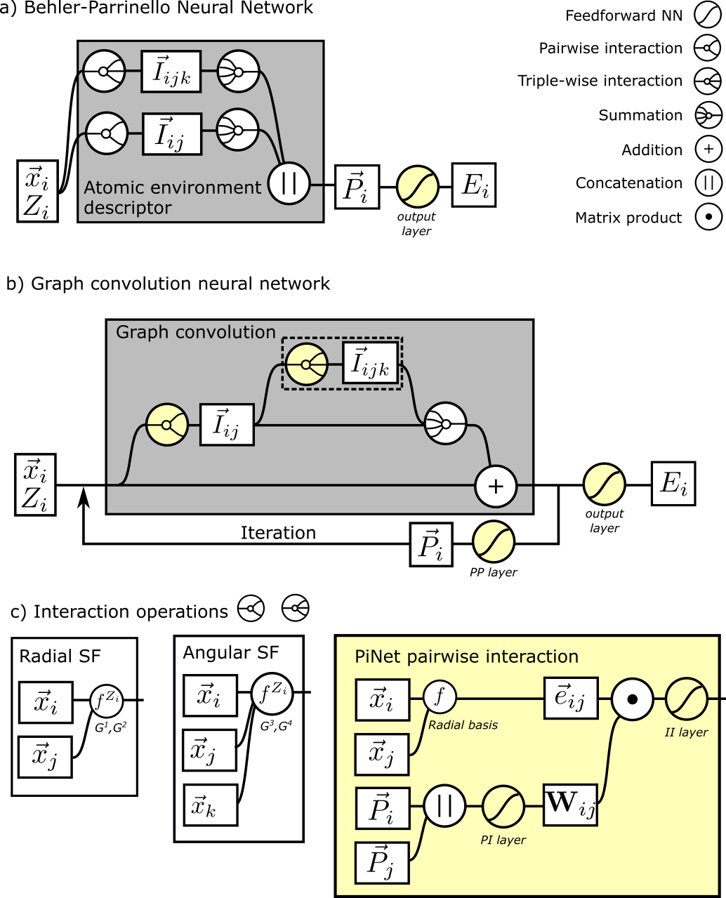

Networks
========

In PiNN, a "network" is a function with learnable parameters, which
yields atomic predictions from a structure, e.g. the ``coord`` and
``elems``. 

Structures of ANN
-----------------

.. note::

   The current section explains how PiNN represents atomic
   neural networks in TensorFlow. This should be helpful if you are
   trying to modify or create a neural network. But you might not need
   to read this if you just want to use one of our implemented
   networks. In that case, you could jump to `Implemented networks`_.

   Fig. Schematic illustration of different ANN structures

As shown in the illustration, most operations of the atomic neural
networks are arithmetic operations or feed-forward neural networks for
atomic properties or interactions. Those operations can be easily
represented using TensorFlow operations. However, the pairwise(or
triple-wise) interactions and the interaction pooling operations
involve the communication between atoms and their neighbors, which
required special treatments.

PiNN's representation of ANNs
-----------------------------

In PiNN, the interactions are represented as sparse slices of the
non-zero values in the :math:`\vec{I_{ij}}` tensor (a n_nodes vector
for each pair of atoms). A ``(n_pairs, 2)`` tensor named as ``ind_2``
is used to index the pair. The pairwise interaction and interaction
pooling are then done with TensorFlow's ``gather_nd`` and
``unsorted_segment_sum`` operations. Notably, PiNN provides a neighbor
list layer to get ``ind_2``, the ``pinn.layers.cell_list_nl`` layer
implements a cell lists algorithm which produces the ``ind_2`` tensor
as well as the pairwise distances and displacements tensors.

Similarly, a ``(n_atoms, 1)`` tensor named as ``ind_1`` is used to
index each atom's position in a batch. And as is done in BPNN, a
``(n_triplet, 2)`` tensor named as ``ind_3`` is used to index each
triplet with two pairs sharing the same central atom.

You can find a demonstration about building an atomic neural network
with PiNN in this :doc:`notebook<../notebooks/Writing_a_network>`.

Implemented networks
--------------------

Two networks are currently implemented in PiNN.  Their parameters can
be found in the API reference below:

.. toctree::
   :maxdepth: 1

   networks/pinet.rst
   networks/bpnn.rst
