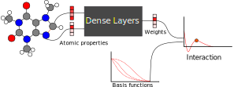
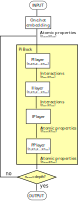

PiNN
====

The vanilla PiNN is yet another graph convolution ANN.
The primary multivation of PiNN is to design the struture
such that the interactions are more compliant to chemical intuition.
The goal for such disign is so that the interactions can be percieved directly.
In PiNN, the interaction is modeled as
**a distance dependent function, whose form depends on the properties of both members in a pair**.

Structure
---------
In PiNN, the interaction is constructed from a radial basis function.
The interaction are meant to be a continous function with cutoff,
therefore, the basis is constructed by the polynomial of the symmetry function
f1 or f2 defined by Behler. :cite:`behler_constructinghighdimensionalneural_2015`

The weights of the interaction are determined from the pairwise interaction (ip)
layer which takes as input the properties from interacting atoms.
The interactions from different neigbours are refined with a fully connected ii
(interaction -> interaction) layer,
and subsequently summed to the central atoms
through a interaction pooling (ip) layer.
The properties are refined with a fully connected pp (property -> property) layer.

Elements are encoded with a one-hot embedding as input.
A PI block consists of such a (pi -> ii -> ip -> pp) cycle,
where pp/ii/pi are essentially fully connected layers.

API reference
-------------
.. autofunction:: pinn.networks.pinn_network

