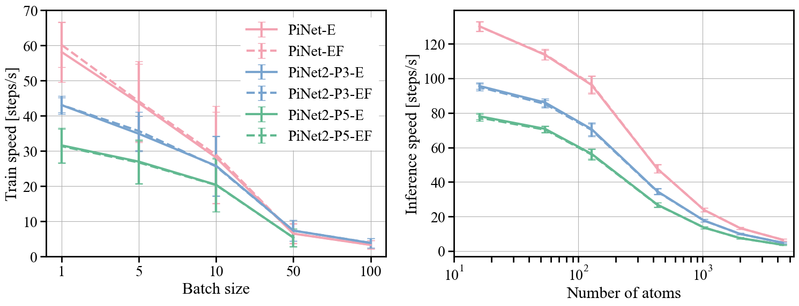

# Benchmarks 

## About the benchmark

PiNN collects a small set of benchmarks that are continuously tested
against (see [version convention]). The benchmark datasets and trained
models are accessible from the shared [box folder].

[version convention]: changelog.md/#conventions
[box folder]: https://uppsala.box.com/v/teoroo-cmc-pinn-data

## Latest benchmarks (v2.0.0)

We have introduced equivariant features (P3 and P5) into the second-generation of PiNet. PiNet2-P3 shows a significant and cost-effective improvement on energy and force predictions across different types of datasets ranging from small molecules to crystalline materials, as compared to PiNet.

### QM9[@2014_RamakrishnanDraletal]

PiNet2-P3 Energy MAE: 8.0(std:0.1) meV

### MD17[@2017_ChmielaTkatchenkoEtAl]


| *Forces Only* / *Energy & Forces*  | PiNet         | PiNet2-P3       | PiNet         | PiNet2-P3       |
|---------------------|---------------|-----------------|---------------|-----------------|
| **Energy (meV)**    |               |                 |               |                 |
| Aspirin             | -             | -               | 17 (3)        | 5.1 (8)         |
| Ethanol             | -             | -               | 1.2 (2)       | 1.1 (3)         |
| Malonaldehyde       | -             | -               | 3.7 (9)       | 1.4 (5)         |
| Naphthalene         | -             | -               | 8.0 (7)       | 1.4 (7)         |
| Salicylic acid      | -             | -               | 8.2 (6)       | 2.3 (8)         |
| Toluene             | -             | -               | 7 (2)         | 1.1 (3)         |
| Uracil              | -             | -               | 30 (3)        | 5.2 (1)         |
|                     |               |                 |               |                 |
| **Force (meV/Å)**   |               |                 |               |                 |
| Aspirin             | 47.7 (6)      | 11.9 (7)        | 54 (3)        | 17 (1)          |
| Ethanol             | 6.3 (8)       | 5.2 (2)         | 7.8 (2)       | 6.1 (9)         |
| Malonaldehyde       | 14 (1)        | 7.1 (5)         | 14.4 (9)      | 7.5 (6)         |
| Naphthalene         | 31 (1)        | 1.9 (1)         | 33 (2)        | 2.9 (1)         |
| Salicylic acid      | 42 (2)        | 6.1 (8)         | 44 (2)        | 8.3 (4)         |
| Toluene             | 23 (1)        | 2.2 (4)         | 27.8 (4)      | 3.3 (4)         |
| Uracil              | 25 (2)        | 3.9 (8)         | 30 (3)        | 5.2 (1)         |

### Material Project

#### MPF.2021.2.8[@2022.Chen4zb]

|   **Energy only**    | PiNet         | PiNet2-P3       | PiNet2-P5     |
|---------------------|---------------|-----------------|---------------|
| Energy (meV)        | 35(4)         | 35(4)           | 32.2(4)       |

| **Energy & Force**   | PiNet         | PiNet2-P3       | PiNet2-P5     |
|---------------------|---------------|-----------------|---------------|
| Energy (meV)        | 42.0 (8)      | 36(1)           | 34.9 (7)      |
| Force (meV/Å)       | 89(1)         | 73(1)           | 70(2)         |

#### MP-crystal-2018.6.1[@chenGraphNetworks2019]

PiNet     Energy MAE: 29.5(std:0.5) meV/atom

PiNet2-P3 Energy MAE: 29  (std:1 )  meV/atom

PiNet2-P3 Energy MAE: 27.7(std:0.5) meV/atom

## Performance

The training and inference computational costs were evaluated on an NVIDIA A100 GPU using the MPF.2021.2.8 dataset:

{width="750"}

## Previous benchmarks (v1.2.0.dev0)

### QM9[@2014_RamakrishnanDraletal]

Energy MAE: 15.0(std:0.83) meV.

### MD17[@2017_ChmielaTkatchenkoEtAl]

- aspirin:   Energy MAE: 19.47(std:9.31) meV; Force MAE: 13.65(std:1.19) meV/Å.
- ethanol:   Energy MAE: 2.62(std:0.38) meV;  Force MAE: 1.98(std:0.08) meV/Å.
- uracil:    Energy MAE: 7.44(std:4.00) meV;  Force MAE: 6.72(std:0.07) meV/Å.

## Reproducing the benchmark

To manually run the benchmarks with the latest version of PiNN you
will need to have [Nextflow] and [Singularity] installed.

[Nextflow]: https://www.nextflow.io/
[Singularity]: https://docs.sylabs.io/guides/latest/user-guide/

```
nextflow run teoroo-cmc/pinn -r master
```

## For developers

Install PiNN in editable mode and run the benchmark
from the `PiNN` folder.  You will probably need to set up the
development environments on an HPC cluster (e.g. ALVIS):

``` bash
ml TensorFlow/2.6.0-foss-2021a-CUDA-11.3.1
python -m venv $HOME/pinn-tf26
source $HOME/pinn-tf26/bin/activate
git clone https://github.com/Teoroo-CMC/PiNN.git && pip install -e PiNN
cd PiNN
```

And run the benchmark using a corresponding profile:

```
export SLURM_ACCOUNT=NAISS2023-5-282
export SALLOC_ACCOUNT=$SLURM_ACCOUNT
export SBATCH_ACCOUNT=$SLURM_ACCOUNT
nextflow run . -profile alvis
```

Adjust the scheduler setup in `nextflow.config` if needed.
