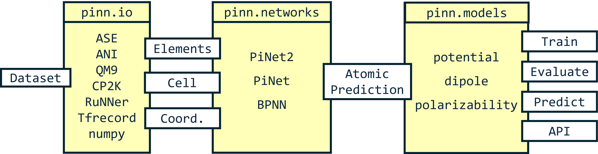

# Introduction

PiNN is a Python library built on top of TensorFlow for building
atomic neural networks (ANNs).  The primary usage of PiNN is to build
and train ANN interatomic potentials, but PiNN is also capable of
predicting physical and chemical properties of molecules and
materials.

## Flexibility

PiNN is built with modularized components and we try to make it as
easy as possible. You do not have to rewrite everything if you just
want to design a new network structure, or apply an existing network
to new datasets or new properties.

## Scalability

PiNN fully adheres to TensorFlow's high-level Estimator and Dataset
API.  It is straightforward to train and predict on different
computing platforms (CPU, multiple-GPU, cloud, etc) without explicit
programming.

## Examples

The quickest way to start with PiNN is to follow our example
[notebooks](notebooks/overview.md). The notebooks provide guides to train a
simple ANN potential with a public dataset, import your own data or further
customize the PiNN for your need.
