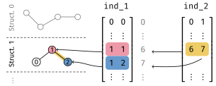

# Shared parts of networks

This page documents the shared layers in different networks, along with the
convention about data structure.

## Convention

### Sparse indices

{width="500"}

Since atomistic data comes in irregular shapes, PiNN uses sparse data structure
for data batching, and the construction of pairwise, triplet-wise tensors. All
these tensors are associated with indices named as `ind_*`, with shapes `ind_1:
[n_atoms, 1]`, `ind_2: [n_pairs, 2]`, etc. The meanings of indices are:


- For `ind_1`: `[i-th_struct_in_batch]`;
- For `ind_2`: `[i-th_atom_in_batch, j-th_atom_in_batch]`;
- For `ind_3`: `[i-th_pair_in_batch, j-th_pair_in_batch]`, with shared central atom;
- ...

## Using sparse indices

To construct a pairwise variable from atom-centered ones, use the
`tf.gather_nd` operator, for instance the following operation broadcasts the
atom-centered $\mathbb{P}_{i\alpha}$ variable to each pair of atoms
($\mathbb{I}_{ij\alpha}=\mathbf{1}_{ij}\mathbb{P}_{i\alpha}$).

```python
I = tf.gather_nd(P, ind_2[:, 0]) + tf.gather_nd(P, ind_2[:, 1])
```

To accumulate pairwise predictions over neighbors ($\mathbb{P}_{i\alpha} =
\sum_{j} \mathbb{I}_{ij\alpha}$), use the `tf.scatter_nd` operation:

```python
P = tf.scatter_nd(ind_2[:, :1], I, shape=[n_atoms, n_alpha])
```

or `tf.math.unsorted_segment_sum`:

```python
P = tf.math.unsorted_segment_sum(I, ind_2[:, 0], natoms)
```

Note that the number of atoms must be supplied since it cannot be inferred from
`ind_2`, it can be inferred from a per-atom tensor instead, e.g.: 

```python
n_atoms = tf.shape(P)[0]
```

## Neighbor list

### CellListNL

::: pinn.layers.nl.CellListNL

## Basis functions

### CutoffFunc

::: pinn.layers.basis.CutoffFunc

### GaussianBasis

::: pinn.layers.basis.GaussianBasis

### PolynomialBasis

::: pinn.layers.basis.PolynomialBasis

## Misc

### AtomicOneHot

::: pinn.layers.misc.AtomicOnehot

### ANNOutput

::: pinn.layers.misc.ANNOutput
