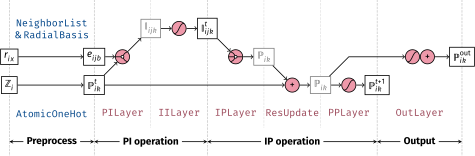

# The PiNet network

The PiNet network implements the network architecture described in our
paper.[@2020_ShaoHellstroemEtAl] The network architecture features the
graph-convolution which recursively generates atomic properties from local
environment. One distinctive feature of PiNet is that the convolution operation
is realized with pairwise functions whose form are determined by the pair,
called pairwise interactions.

## Network architecture

The overall architecture of PiNet is illustrated with the graph convolution block below:

{width="600"}

We classify the latent variables into the atom-centered "properties"
($\mathbb{P}$) and the pair-wise "interactions" ($\mathbb{I}$) in our notation.
Since the layers that transform $\mathbb{P}\to\mathbb{P}$ or
$\mathbb{I}\to\mathbb{I}$ are usually standard feed-forward neural networks (FF
layers), the more important part of PiNet are the PI and IP layers, which
transform between those two types of variables.

The operations are generally grouped into the PI and IP operations that
constitutes a GC block, which can be further composed of individual layers, as
shown above. Each of the layers is sub-classed from `tf.keras.layers.Layer`. The
`PiNet` class provides a few parameters to control those layers. Check the layer
specification below for more detailed description of the layers.

## Network specification

### pinet.PiNet

::: pinn.networks.pinet.PiNet

## Layer specifications

### pinet.FFLayer

::: pinn.networks.pinet.FFLayer

### pinet.PILayer

::: pinn.networks.pinet.PILayer

### pinet.IPLayer

::: pinn.networks.pinet.IPLayer

### pinet.ResUpdate

::: pinn.networks.pinet.ResUpdate

### pinet.OutLayer

::: pinn.networks.pinet.OutLayer

    
## Source Code

??? "pinn/networks/pinet.py"

    ```python
    --8<-- "pinn/networks/pinet.py"
    ```

\bibliography
