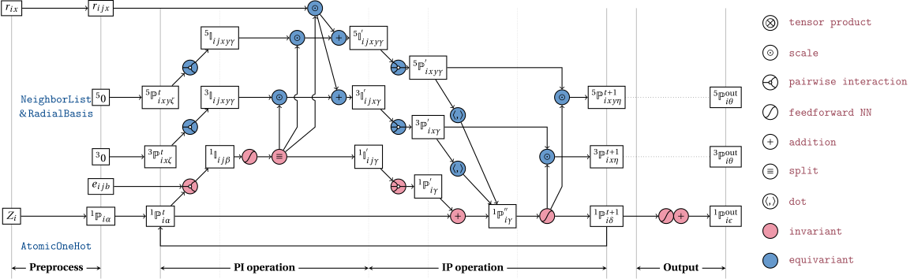
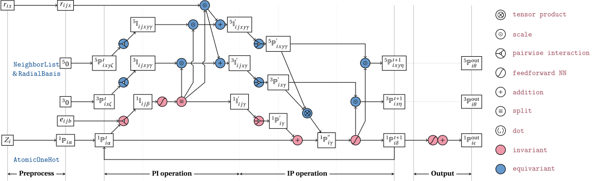

# The PiNet2 network

PiNet2 represents the next generation of PiNet, now equipped with equivariant support. This network architecture incorporates graph convolution to iteratively derive atomic scalar and tensor properties from the local environment. One noteworthy aspect of PiNet2 is its utilization of convolution operations that are executed through pairwise functions, whose specific forms are dictated by the pairs themselves, known as pairwise interactions, while also maintaining equivariant features. 

Pinet2 variants are characterized by their use of different mathematical structures and representations. The basic version utilizes vector representations(`P3`), while the advanced version incorporates second-order tensors, denoted as `p5`. Each `p5` variant features three distinct representations: `prod`, `dot` and `combine`. To enhance performance, the `p5` variant employs irreducible representations, donated by `irrep`. 

## Network architecture

The start architecture of PiNet2 is illustrated with the illustration below:

{width="750"}

PiNet2 follows the structure of pinet and adds first-order equivarible, which are demonstrated in blue nodes. Equalvariance-target layers are implemented and tested, e.g. `PIXLayer`, `ScaleLayer` and `DotLayer`, and rest of layers reuse PiNet code. The details about those layer can be found below. 

Indices denoted the dimensionality of each variable still following previous the convention:

- $b$: basis function index;
- $\alpha,\beta,\gamma,\ldots$: feature channels;
- $i,j,k,\ldots$: atom indices;
- $x,y,z$: Cartesian coordinate indices.

The number in left-top of a variable indicates the dimension. For instance, ${}^{3}\mathbb{P}^{t}_{ix\zeta}$ means it is a property in $\mathbb{R}^3$, and `x` is index representing three coordinates. 

Building upon the architecture depicted in the previous figure, we introduce an additional intermediate representation using second-order tensors. The tensor is initialized as zero array with shape `(n_atoms, 3, 3, n_channels)` or `(n_atoms, 5, n_channels)` (`irrep`). The term "irrep" stands for "irreducible representation," which employs 5 independent elements rather than the 9 elements found in a symmetry matrix. In this context, we use the basis $(2/3 x^2 - 1/3 y^2 - 1/3 z^2, 2/3 y^2 - 1/3 z^2 - 1/3 x^2, xy, xz, yz)$ to define the irreducible representation.

The combination of vectorial and tensorial representations, and accumulated to scalar through two distinct processes. Firstly, the dot product of vectorial and tensorial elements results in a scalar sum. Secondly, the vectorial and tensorial components are subjected to a tensor product operation, yielding another scalar outcome. 

{width="750"}

{width="750"}

We additionally offer a combined version, which conducts both the dot product operation on two representations and the tensor product operation, subsequently summing these two parts to yield the scalar.

The equations that explain each of the above layers and the hyperparameters
available for the PiNet2 network are detailed below.

## Network specification

### pinet2.PiNet2

::: pinn.networks.pinet2.PiNet2

## Layer specifications

### pinet2.PIXLayer

::: pinn.networks.pinet2.PIXLayer

### pinet2.DotLayer

::: pinn.networks.pinet2.DotLayer

### pinet2.ScaleLayer

::: pinn.networks.pinet2.ScaleLayer

\bibliography
