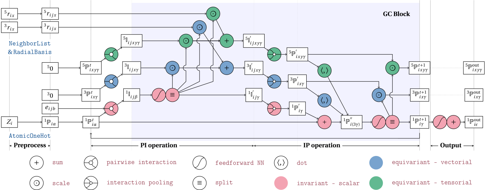

# The PiNet2 network

PiNet2 represents the next generation of PiNet, now equipped with equivariant support. This network architecture incorporates graph convolution to iteratively derive atomic scalar and tensor properties from the local environment. One noteworthy aspect of PiNet2 is its utilization of convolution operations that are executed through pairwise functions, whose specific forms are dictated by the pairs themselves, known as pairwise interactions, while also maintaining equivariant features.

## Network architecture

The overall architecture of PiNet2 is illustrated with the illustration below:

{width="750"}

PiNet2 follows the structure of pinet and adds first-order equivarible, which are demonstrated in blue nodes. Equalvariance-target layers are implemented and tested, e.g. `PIXLayer`, `ScaleLayer` and `DotLayer`, and rest of layers reuse PiNet code. The details about those layer can be found below. 

Indices denoted the dimensionality of each variable still following previous the convention:

- $b$: basis function index;
- $\alpha,\beta,\gamma,\ldots$: feature channels;
- $i,j,k,\ldots$: atom indices;
- $x,y,z$: Cartesian coordinate indices.

The number in left-top of a variable indicates the dimension. For instance, ${}^{3}\mathbb{P}^{t}_{ix\zeta}$ means it is a property in $\mathbb{R}^3$, and `x` is index representing three coordinates. 

The equations that explain each of the above layers and the hyperparameters
available for the PiNet2 network are detailed below.

## Network specification

### pinet2.PiNet2

::: pinn.networks.pinet2.PiNet2

## Layer specifications

### pinet2.PIXLayer

::: pinn.networks.pinet2.PIXLayer

### pinet2.DotLayer

::: pinn.networks.pinet2.DotLayer

### pinet2.ScaleLayer

::: pinn.networks.pinet2.ScaleLayer

\bibliography
